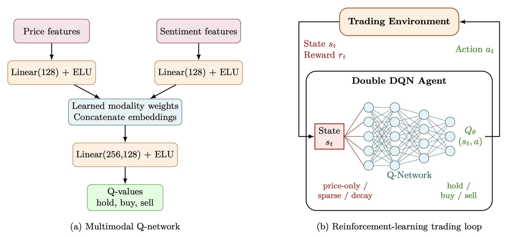
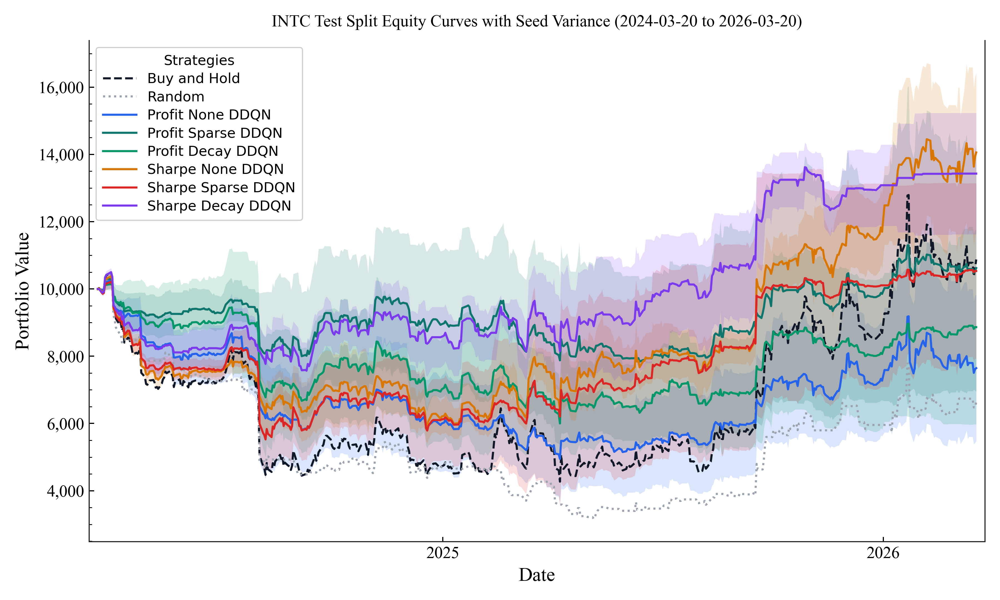

# Deep Reinforcement Learning Asset Trading Agent

Codebase for single-asset trading experiments with:

- daily OHLCV price data
- Alpha Vantage news sentiment
- buy-and-hold and random benchmarks
- Double DQN with profit and differential-Sharpe rewards
- reproducible train/validation/test comparisons across sentiment variants

<p align="center">
  
</p>

## Current Scope

- Single asset only
- Long/flat discrete actions: `hold`, `buy`, `sell`
- Daily trading environment
- Explicit date-based train/validation/test splits
- Reproducible configs and saved artifacts for reruns

## Repository Layout

```text
.
├── configs/
├── data/
├── docs/
├── reports/
├── results/
└── src/drl_asset_trading/
    ├── agents/
    ├── data/
    ├── envs/
    ├── evaluation/
    ├── experiments/
    ├── features/
    └── strategies/
```

## Pipeline

The top-level pipeline entry point is:

```bash
python3 -m drl_asset_trading.main --config configs/baseline_experiment.json
```

It runs four stages:

1. load or cache price data
2. load or cache sentiment data
3. build processed feature datasets
4. run either the full comparison suite or the profit-only sentiment comparison

Key command options:

- `--ticker AAPL`
- `--comparison-mode full`
- `--comparison-mode profit_sentiment`
- `--seeds 42,43,44,45,46`
- `--force-price-download`
- `--force-sentiment-download`

## Runbook

Common entry points:

- full pipeline:
  - `python3 -m drl_asset_trading.main --config configs/baseline_experiment.json`
- full comparison only:
  - `python3 -m drl_asset_trading.experiments.run_full_comparison --config configs/baseline_experiment.json --seeds 42,43,44,45,46`
- profit-only sentiment comparison:
  - `python3 -m drl_asset_trading.experiments.run_profit_sentiment_comparison --config configs/baseline_experiment.json --seeds 42,43,44,45,46`
- single DDQN run:
  - `python3 -m drl_asset_trading.experiments.run_ablation --config configs/baseline_experiment.json --reward-mode profit --sentiment-variant decay`
- benchmark heuristics only:
  - `python3 -m drl_asset_trading.evaluation.run_benchmarks --config configs/baseline_experiment.json --dataset price`
- feature build only:
  - `python3 -m drl_asset_trading.features.run_feature_builder --config configs/baseline_experiment.json`
- differential Sharpe eta sweep:
  - `python3 -m drl_asset_trading.experiments.run_differential_sharpe_eta_sweep --config configs/baseline_experiment.json --seeds 42,43,44,45,46`
- replot full-comparison report graphs from existing CSV artifacts only:
  - `python3 -m drl_asset_trading.experiments.replot_full_comparison --config configs/baseline_experiment.json`
  - optional seed override: `python3 -m drl_asset_trading.experiments.replot_full_comparison --config configs/baseline_experiment.json --seeds 42,43,44,45,46`

For a fuller run guide and config reference, see [`docs/running_experiments.md`](/Users/rahilshah/Development/DRL-Asset-Trading-Agent/docs/running_experiments.md).

## State Representations

The code builds three processed datasets:

- `price`
- `price_sentiment_sparse`
- `price_sentiment_decay`

### Price Features

The shared price branch is engineered for daily trading and currently includes:

- `return_1`
- `log_return_1`
- `momentum_{lookback}`
- `volatility_{lookback}`
- `rsi_{lookback}`
- `volume_change_1`
- cyclical `day_of_week_sin/cos`
- cyclical `day_of_year_sin/cos`

### Sentiment Features

The model-facing sentiment branch uses:

- `news_count`
- `mean_ticker_sentiment`
- `mean_ticker_relevance`
- `sentiment_std`
- `sentiment_mean_3`
- `sentiment_mean_7`
- `sentiment_diff_1`
- `sentiment_window_spread_3_7`

Variant-specific behavior:

- `none`
  - no sentiment features
- `sparse`
  - lagged daily sentiment, zero-filled on no-news days
- `decay`
  - lagged daily sentiment with forward carry and exponential decay
  - adds `days_since_last_news`

The processed state intentionally drops the more redundant raw daily aggregates `mean_overall_sentiment` and `weighted_ticker_sentiment`.

## Model

The RL agent is a Double DQN.

When sentiment features are present, the Q-network treats price and sentiment as separate modalities:

- price features and position are routed to a price embedding layer
- sentiment features are routed to a sentiment embedding layer
- both embeddings use `Linear -> ELU`
- the fused representation is passed to the Q-value head

When no sentiment features are present, the agent falls back to a plain MLP over the price-only observation.

The architecture diagram above reflects the multimodal price-plus-sentiment variant used in the main comparison runs.

## Reward Modes

Two experiment axes define the main comparisons:

- `reward_mode`: `profit` or `sharpe`
- `sentiment_variant`: `none`, `sparse`, or `decay`

Run names are built directly from those axes, for example:

- `profit_none`
- `profit_sparse`
- `profit_decay`
- `sharpe_none`
- `sharpe_sparse`
- `sharpe_decay`

## Overfitting Controls

The training pipeline now includes:

- train-split-only feature scaling
- persisted per-run scaler artifacts
- validation-based checkpoint selection through `rl.validation_metric`
- early stopping using the same validation metric
- optional Adam `weight_decay`
- explicit train vs validation vs test metric logging

Important leakage rules:

- scalers are fit on the train split only
- redundant-feature diagnostics are computed on the train split only
- test metrics are only evaluated after loading the best validation checkpoint
- price and sentiment features are generated causally from current and past data only

## Artifacts

Typical outputs include:

- processed datasets in `data/processed/...`
- run manifests and metrics in `results/...`
- comparison tables and plots in `reports/<TICKER>/...`
- feature diagnostics at `reports/<TICKER>/<TICKER>_<START>_<END>_feature_diagnostics.json`

The full comparison runner now saves:

- test equity curves
- test drawdowns
- test equity curves with seed-variance bands

## Example Output

An example test-set report generated by the full comparison pipeline:

<p align="center">
  
</p>

Sentiment caching behavior:

- if cached raw sentiment JSON exists, missing interim sentiment files are rebuilt from cache
- the API is only called again when raw sentiment is missing or `--force-sentiment-download` is used

## Setup

```bash
python -m venv .venv
source .venv/bin/activate
pip install -e .
cp .env.example .env
```

## Docs

- [`docs/ablation_variants.md`](/Users/rahilshah/Development/DRL-Asset-Trading-Agent/docs/ablation_variants.md)
- [`docs/running_experiments.md`](/Users/rahilshah/Development/DRL-Asset-Trading-Agent/docs/running_experiments.md)
- [`docs/reward_engineering.md`](/Users/rahilshah/Development/DRL-Asset-Trading-Agent/docs/reward_engineering.md)
